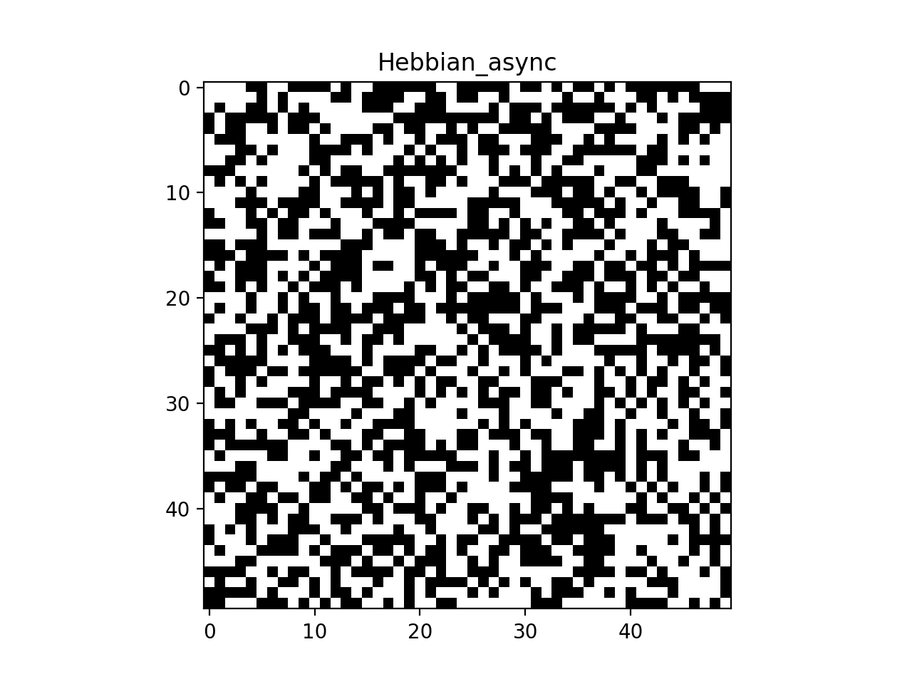
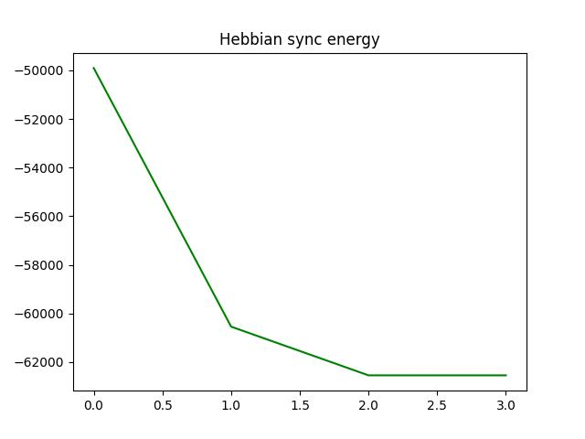
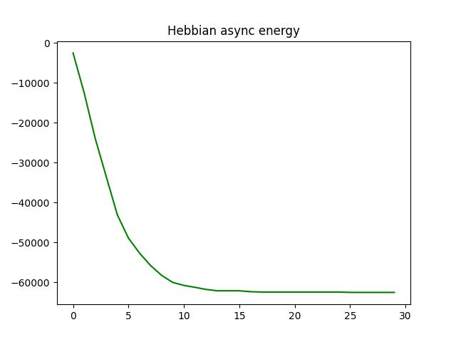
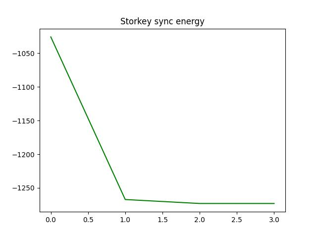
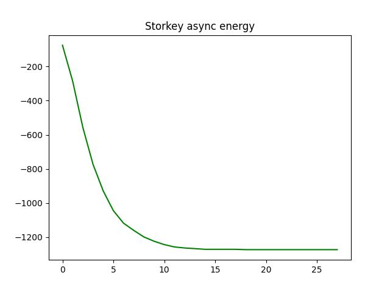

# Applied software engineering for Life Sciences (BIO-210)

## Project 1 - Hopfield network

The Hopfield network is a computational model for associative memory, proposed by John Hopfield in 1982. It models a simple mechanism to explain how a neural network could store representations (i.e., the neural activity corresponding to a certain concept) in the form of weighted connections between neurons. 

This project will provide an implementation of the iterative process which allows retrieval of one of the stored (memorized) patterns starting from the representation of a new (unseen) pattern.

This project uses two different learning rules to initialize the weights matrix:
- **Hebbian** learning rule
- **Storkey** learning rule

The update rule is applied in the dynamics evolution using a **synchronous** and an **asynchronous** rule.

After computing the weights matrix, we modify a random pattern of the base patterns with a fixed number of perturbations. Then, from the perturbated pattern and the weights matrix, we can retrieve the original pattern after updating the perturbated pattern with the **synchronous** or the **asynchronous** rule.

To check if **convergence** has been achieved, we compare the state before and after updating. If those two are similar for a consequent number of updates, i.e. if the update has no effect anymore, we can consider that the network has retrieved its original state.

The **energy value** of a state is also computed. The closer the state is to convergence, the lower the energy linked to that state will be. The energy of the network is therefore a non-increasing quantity.

## Contents
* [Authors](#authors)
* [Requirements](#requirements)
* [Files](#files)
* [Execution](#execution)
* [Results](#results)
* [Tests](#tests)
* [Coverage](#coverage)
* [Releases](#releases)

See also the [**report summary**](summary.md) of the Model analysis (capacity and robustness experiments).

## Authors
* Marguerite Derwael ([@MargueriteDerwael](https://github.com/MargueriteDerwael))
* Oskar Boesch ([@oskarboesch](https://github.com/oskarboesch))
* Johann Clausen ([@Johanncc01](https://github.com/Johanncc01))

## Requirements
You will need to have the following packages to execute this project:
- [`python (>3.5)`](https://www.python.org/)
- [`numpy`](https://numpy.org/)
- [`matplotlib`](https://matplotlib.org/)
- [`pytest`](https://docs.pytest.org/)
    - [`pytest-benchmark`](https://pytest-benchmark.readthedocs.io/en/latest/)
- [`coverage`](https://pypi.org/project/coverage/)

To download the repository on your machine, you should also have [`git`](https://git-scm.com/) installed on your computer.

Open the terminal in the desired folder and type :
```
$ git clone https://github.com/EPFL-BIO-210/BIO-210-22-team-3.git
```
Then, go to the root of the project by typing :
```
$ cd BIO-210-22-team-3
```

## Files
* [`main.py`](main.py)

    The main file is where you can execute the project.
    Contains:
    * `checkboard()`, which runs a checkboard recalling experiment
    * `main_experiment()`, which runs a capacity experiment and generate several plot and files
    * `image_recalling()`, which recalls a perturbated image using a Hopfield Network

* [`HopfieldNetwork.py`](HopfieldNetwork.py)

    Definition of the `HopefieldNetwork` class. This class defines the network and generates the weights according to given patterns.

* [`DataSaver.py`](DataSaver.py)

    Definition of the `DataSaver` class. Used to store the sequence of states and their associated energy.

* [`patterns.py`](patterns.py)

    Definition of patterns core functions used to generate and perturb the binary patterns. Also defines the checkboard-to-pattern and image-to-pattern conversions. 

* [`experiment.py`](experiment.py)

    Definition of the model analysis computations, i.e. testing capacity and robustness of our implementation of the Hopfield Network.

* [`profiling.py`](profiling.py)

    Runs cProfile on the project to see the execution time and the functions timings.

The test files are located in the `Tests` folder:

* [`test_checkboard.py`](Tests/test_checkboard.py)

    Tests the generation and execution of the project on a checkboard pattern.

* [`test_DataSaver.py`](Tests/test_DataSaver.py)

    Tests the DataSaver methods, including energy computation and saving of videos and plots.

* [`test_HopfieldNetwork.py`](Tests/test_HopfieldNetwork.py)

    Tests the HopfieldNetwork methods, including weights methods and dynamics evolution.

* [`test_patterns.py`](Tests/test_patterns.py)

    Tests the functions associated with patterns, including generation, perturbation and match.

The visual output files are located in the `Outputs` folder. Here are saved the videos of dynamics evolution and the plots of energy.

The technical outputs files are located in the `Results` folder, including the results of model analysis and `Pandas` dataframes exported in .hdf.

The `Inputs` folder handles the images before calling `image_recalling()`, and the results of this function are saved in the `Images` folder.

The `.github` folder contains definitions for the GitHub actions, i.e. running pytest on multiple platforms in GitHub.
## Execution

How to run the program
* If you are using VScode on your machine, go to the main.py file and just click the `Run Python File in Terminal` play button on the top-right side of the editor.
* To run with the python command, you need to open a command line and call the main.py file with python. The command depends on your installation (python or python3):
```
$ python3 main.py
```
The results will then be saved, including:
* Videos of the evolution of the system using a perturbated 50x50 checkboard, using all the different rules (hebbian, storkey, sync, async)
* Plot of the energy values decreasing with the updates, again for all different rules.
* Videos of the process of image recalling, with different rules and the specified method (square, random perturbation)
* Model analysis outputs, as .hdf files and plots showing the capacities and robustness.

> The execution time for `main.py` (calling only `checkboard()`) on our machine is 9.17sec, which is great given the number of computations. If calling the `main_experiment()` function, the runtime can be higher due to demanding model analysis computations.
## Results

Here are all our main results :

* Evolution of the 50x50 checkboard:





* Energy plots :






There is also our [**report**](summary.md) file which explains and shows the *capacity* and *robustness* experiments that we made on our code.

## Tests
The tests are implemented using `pytest`.
* To run the tests, you can call `pytest` in the directory of the project. You will have :
    - The results of the tests, i.e. which pass and the total execution time
    - A summary of the mean execution time of the main functions (using `pytest-benchmark`)

Calling the `pytest` command runs all the files that begin with "test_", i.e. the test files of our project. Most functions are tested using this method.

## Coverage
You can compute the coverage of the tests by running these commands :
```
$ coverage run -m pytest
$ coverage report
```
You can also visualise coverage results by calling:
```
$ coverage run -m pytest
$ coverage html
```
and opening the file `index.html` in the new folder created by the package.
> note: at the end of each testing file, a section using if \_\_name__ == "\_\_main__": launches pytest if the file is run as a script. These lines are never run when running the pytest command, and this behavior is expected. However, this impacts the coverage results, and a result between 95% and 100% is expected.

## [Releases](https://github.com/EPFL-BIO-210/BIO-210-22-team-3/releases)
* v1.0
    Introduction
* v2.0
    Functionify
* v3.0
    Vizualisation and documentation
* v4.0
     Testing
* v5.0
    Reproducible code
    * v5.1
        Bug fix
* v6.0
    Profiling and code optimization
* v7.0
    Object-oriented programming
* v8.0
    Model analysis and summary