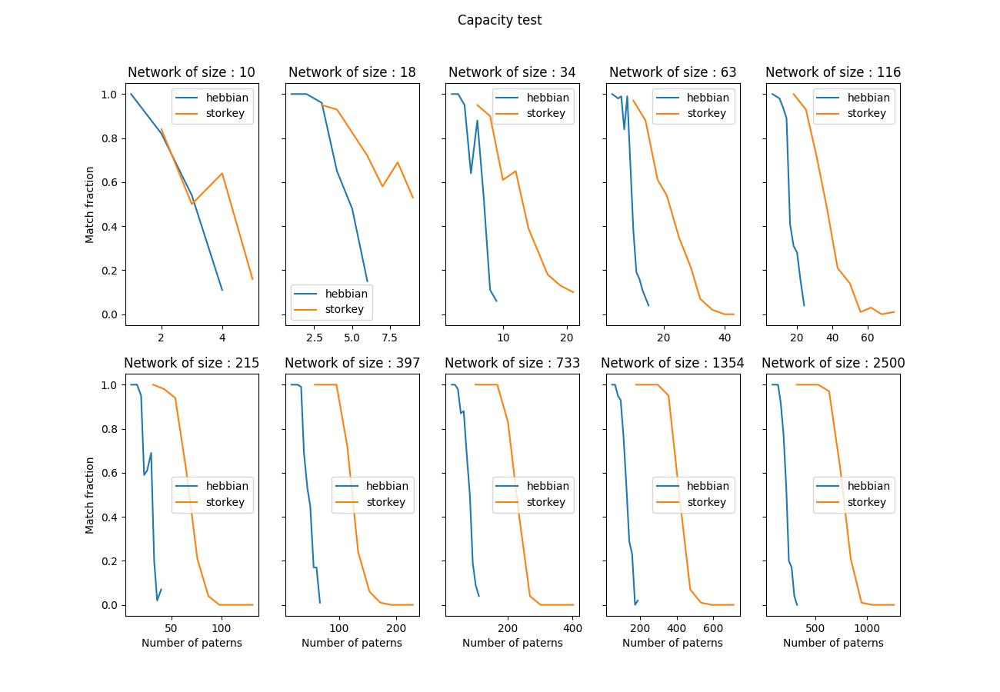
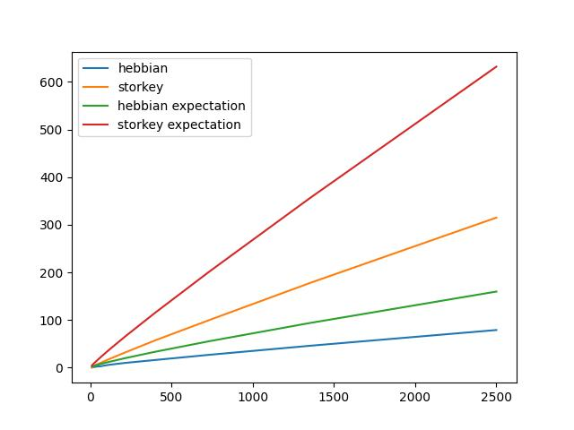
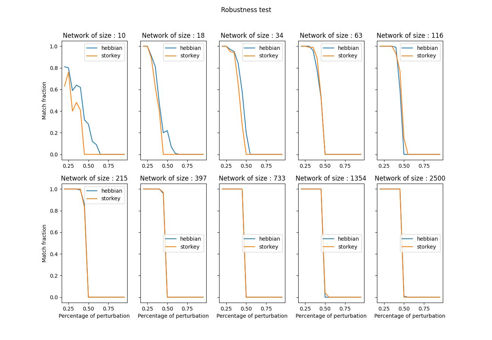
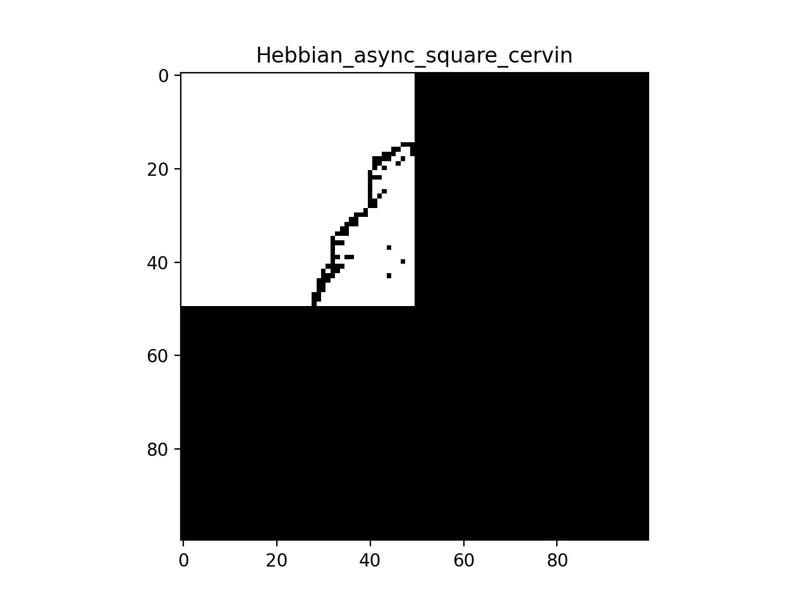
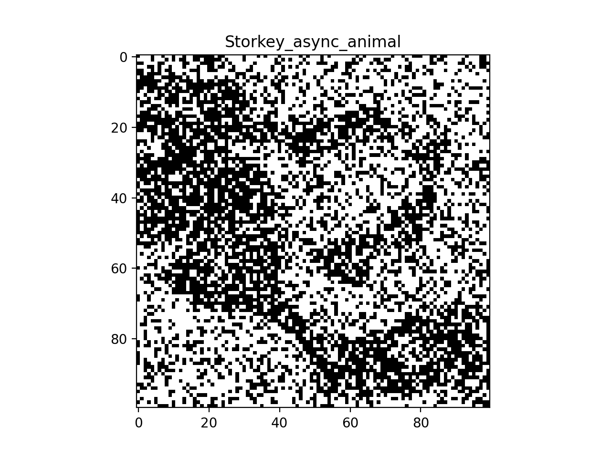

# BIO-210-team-3
## Hopfield Network - Report

### Table of content

* [Capacity](#capacity)
* [Robustness](#robustness)
* [Examples](#examples)

See also the [**README**](README.md) file of the project for instructions on how to execute the code and the global project structure.

# Capacity
An important feature of a Hopfield network is the storage capacity, i.e. how many patterns can the model store. The network is said to have stored a pattern if, when presented with a perturbed version of the such pattern, the dynamical system converges to the original one. **McEliece** derived an asymptotic convergence estimate for the number of patterns that a Hopfield network with the Hebbian rule can store as a function of the number of neurons.

Here, we empirically estimated the capacity of the Hopfield network, trained
with the Hebbian and Storkey rules and simulated with the synchronous update rule

> This plot represents the fraction of retrieved patterns vs. the number of patterns for each size *n*. 

> This plot compares our empirical capacity curves, including the number of neurons vs. capacity for both learning rules, to the theoretical estimate.

# Robustness

To know how much we can perturb the original pattern, to still allow retrieval, we consider the same network size range as in the previous tasks but limit ourselves with
20% perturbation, then progressively increase the initial perturbation by steps of 5% until we reach 100%.

Those are the result tables, for Hebbian and Storkey respectively:

 

**Hebbian robustness results**

|    |   network_size | weights_rule   |   num_patterns |   num_perturb |   match_frac |
|---:|---------------:|:---------------|---------------:|--------------:|-------------:|
|  0 |             10 | hebbian        |              2 |          0.2  |         0.81 |
|  1 |             18 | hebbian        |              2 |          0.3  |         0.91 |
|  2 |             34 | hebbian        |              2 |          0.35 |         0.95 |
|  3 |             63 | hebbian        |              2 |          0.35 |         0.96 |
|  4 |            116 | hebbian        |              2 |          0.4  |         0.99 |
|  5 |            215 | hebbian        |              2 |          0.4  |         0.99 |
|  6 |            397 | hebbian        |              2 |          0.45 |         0.96 |
|  7 |            733 | hebbian        |              2 |          0.45 |         1    |
|  8 |           1354 | hebbian        |              2 |          0.45 |         1    |
|  9 |           2500 | hebbian        |              2 |          0.45 |         1    |

**Storkey robustness results**

|    |   network_size | weights_rule   |   num_patterns |   num_perturb |   match_frac |
|---:|---------------:|:---------------|---------------:|--------------:|-------------:|
|  0 |             10 | storkey        |              2 |          0.2  |         0.63 |
|  1 |             18 | storkey        |              2 |          0.25 |         1    |
|  2 |             34 | storkey        |              2 |          0.35 |         0.94 |
|  3 |             63 | storkey        |              2 |          0.35 |         0.99 |
|  4 |            116 | storkey        |              2 |          0.4  |         0.93 |
|  5 |            215 | storkey        |              2 |          0.4  |         1    |
|  6 |            397 | storkey        |              2 |          0.45 |         0.97 |
|  7 |            733 | storkey        |              2 |          0.45 |         1    |
|  8 |           1354 | storkey        |              2 |          0.45 |         1    |
|  9 |           2500 | storkey        |              2 |          0.45 |         1    |

 

> This plot represents the fraction of retrieved patterns vs. the number of perturbations.

# Examples
Those are our favorite retrieval examples.
We selected 100 x 100 pixel images and binarize them. We stored it in a Hopfield network and the model can recall the complete image from an incomplete subset of an image (the upper left quarter) or an evenly corrupted image.

  
  

 

> Retrieving an image from the original upper left corner, using the **Hebbian** weights and the asynchronous update.

  
  

 

> Retrieving of an image randomly perturbated using the **Storkey** weights and the asynchronous update.
